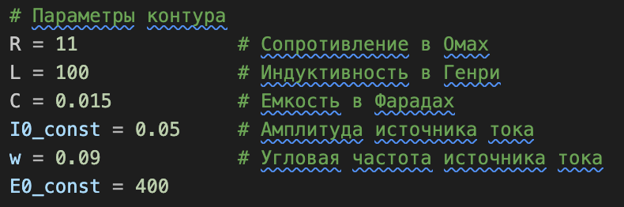
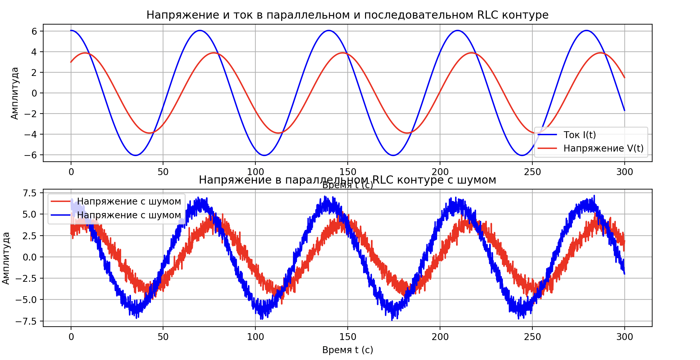
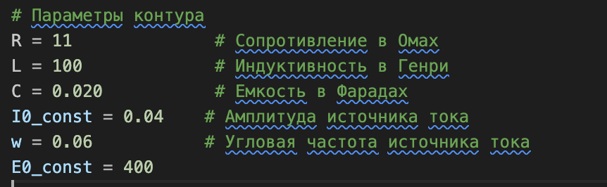
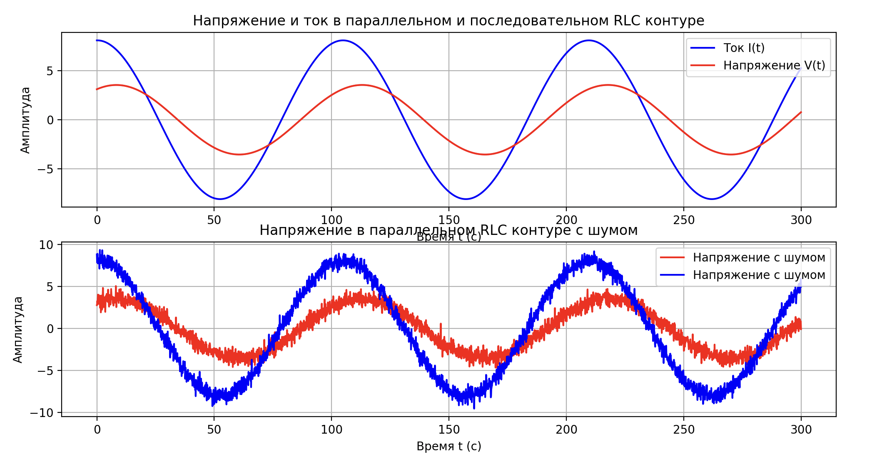
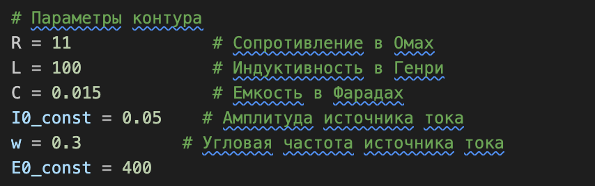
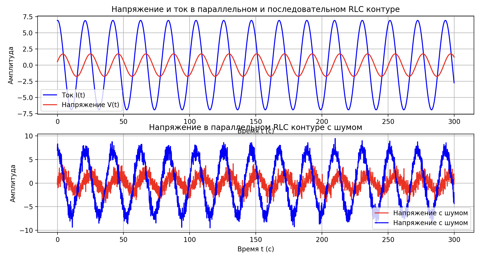
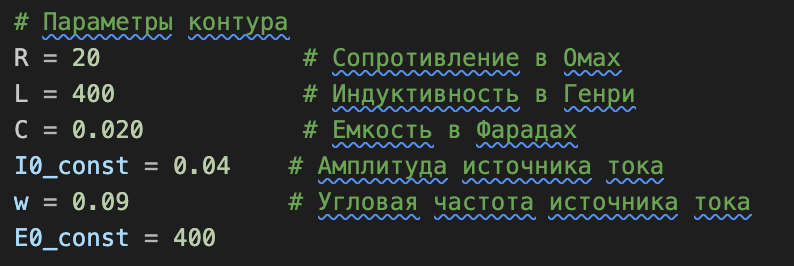
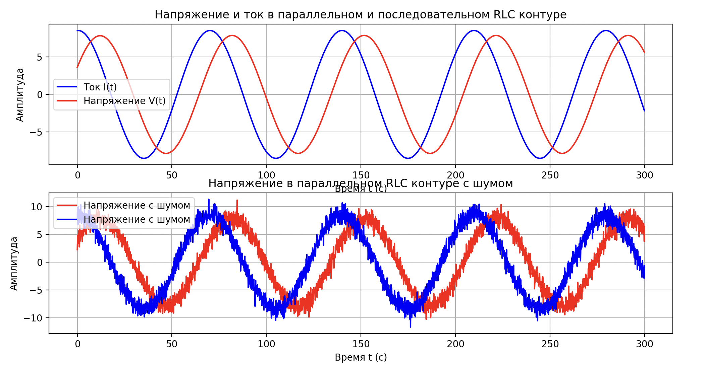

# Колебания в электрической цепи

## Зависимости
Python3, numpy, matplotlib

## Описание последовательной цепи
Для численного моделирования использовался метод Рунге-Кутты 4-го порядка

Для последовательной RLC цепи было взято и преобразованно диффиринциальное уравнение 2 порядка:
$\\\cfrac{d^2q}{dt^2} + 2\beta\cfrac{dq}{dt} + \omega_{0}^{2}q = \cfrac{E_{0}}{L}\cos{(\omega t)}$,  
где q - заряд, t - время, $E_{0}$ - амплитуда напряжения, L - индуктивность, R - сопротивление, С - емксоть конденсатора, $2\beta = \cfrac{R}{L}$, $\omega_{0}^{2} = \cfrac{1}{LC}$

Для численного дифференцирования преобразуем уравнение в систему уравнений первого порядка:$\\$
$
  \begin{cases}
    \cfrac{dq}{dt} = I      \\
    \cfrac{dI}{dt} = \cfrac{E_{0}\cos{(\omega t)}}{L} - 2\beta I - \omega_{0}^{2}q  
  \end{cases}
\\$
Соответсвенно для начальных условий нужно задать $q_{0}$ и $I_{0}$. Они задаются по формулам:$\\$
$q_{0} = \cfrac{E_{0} \cdot \cos{(\omega t + \varphi)}}{\omega\sqrt{R^{2} + \Big(\omega L - \cfrac{1}{\omega C}\Big)^{2}}}$ $\\$
После дифференцирования получаем уравнение для тока:$\\$
$I_{0} = \cfrac{E_{0} \cdot \cos{(\omega t - \theta)}}{\sqrt{R^{2} + \Big(\omega L - \cfrac{1}{\omega C}\Big)^{2}}}$, $\\$
 где $\varphi = \arctan\Bigg(\cfrac{R}{\omega L - \cfrac{1}{\omega C}}\Bigg)$ и $\theta = -(\varphi + \cfrac{\pi}{2})\\$

## Описание параллельной цепи
Для параллельной RLC цепи было взято и преобразованно диффиринциальное уравнение 2 порядка:
$\\ C\cfrac{d^2V}{dt^2} + \cfrac{1}{R} \cdot \cfrac{dV}{dt} + \cfrac{V}{L} = I_{0}\sin{(\omega t)}$,  
где V - напряжение, t - время, L - индуктивность, R - сопротивление, С - емксоть конденсатора.

Для численного дифференцирования преобразуем уравнение в систему уравнений первого порядка:$\\$
$
  \begin{cases}
    dV = \cfrac{dV}{dt}      \\
    d^{2}Vd^{2}t = \cfrac{I_{0} \cos{(\omega t)}}{C} - (2\beta \cdot \cfrac{dV}{dt}) - (\omega_{0}^{2} \cdot V)  
  \end{cases}
\\$
Соответсвенно для начальных условий нужно задать $V_{0}$ и $V/dt_{0}$. Они задаются по формулам:$\\$
$V_{0} = \cfrac{I_{0} \cos{(\omega t + \varphi)}}{\omega \sqrt{R^{-2} + \bigg(\omega C - (\omega L)^{-1} \bigg)^{2}}}\\$
После дифференцирования получаем:$\\$
$dVdt_{0} = \cfrac{I_{0} \cos{(\omega t + \varphi)}}{\sqrt{R^{-2} + \bigg(\omega C - (\omega L)^{-1} \bigg)^{2}}},\\$ 

где $\varphi = \arctan\Bigg(\cfrac{R}{\omega L} - \omega C R\Bigg)\\$

К конечным результатам был применен шум, реализованный как случайное число в нормальном распределении c параметрами 0 и 0.5.

## Примеры результата

### 1:

 

### 2:

 

### 3:

 

### 4:

 

