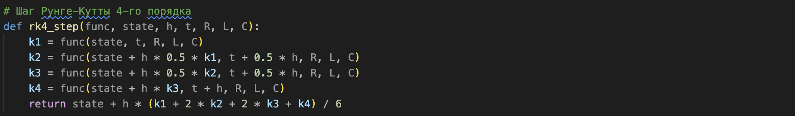
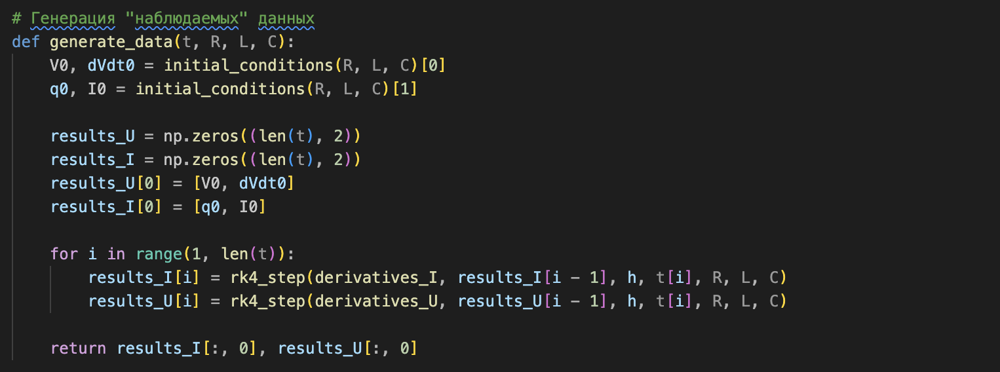
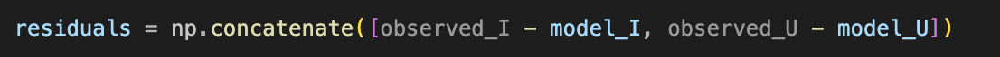
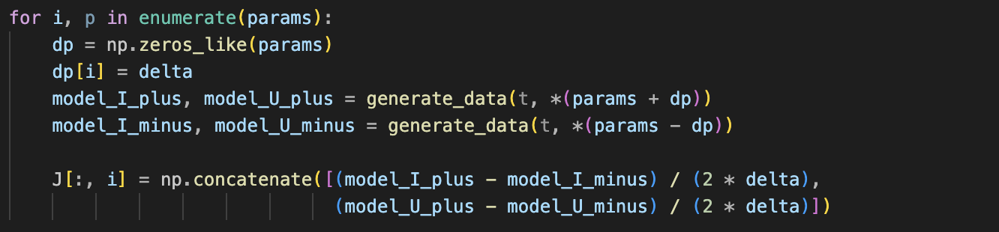
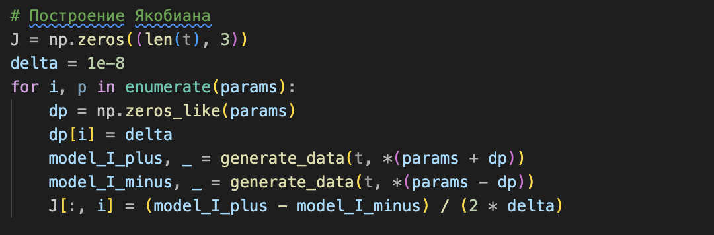
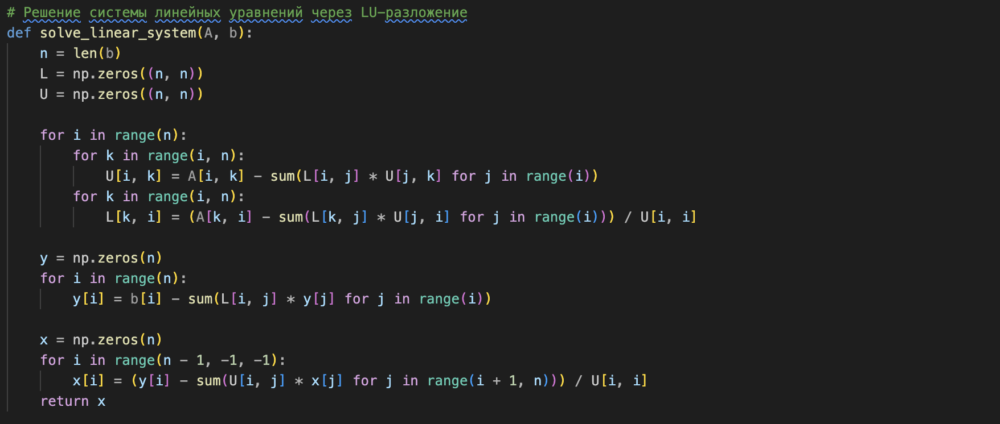
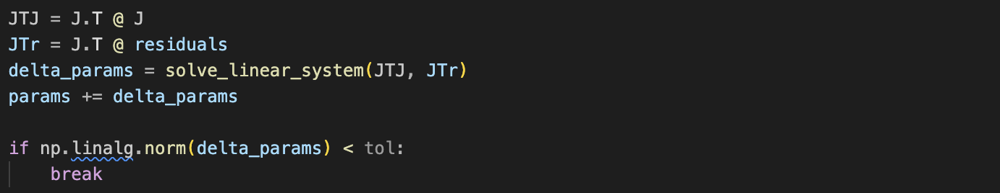
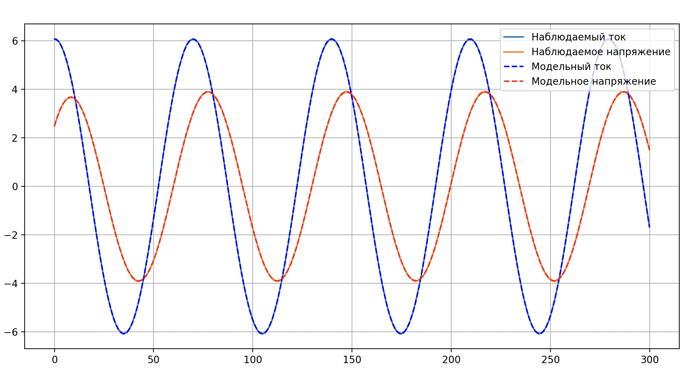

# Колебания в электрической цепи

## Зависимости
Python3, numpy, matplotlib

## Описание последовательной цепи
Для численного моделирования использовался метод Рунге-Кутты 4-го порядка

Для последовательной RLC цепи было взято и преобразованно диффиринциальное уравнение 2 порядка:
$\\ \cfrac{d^2q}{dt^2} + 2\beta\cfrac{dq}{dt} + \omega_{0}^{2}q = \cfrac{E_{0}}{L}\cos{(\omega t)}$,  
где q - заряд, t - время, $E_{0}$ - амплитуда напряжения, L - индуктивность, R - сопротивление, С - емксоть конденсатора, $2\beta = \cfrac{R}{L}$, $\omega_{0}^{2} = \cfrac{1}{LC}$

Для численного дифференцирования преобразуем уравнение в систему уравнений первого порядка:

 

Соответсвенно для начальных условий нужно задать $q_{0}$ и $I_{0}$. Они задаются по формулам:

 

После дифференцирования получаем уравнение для тока:

 

## Описание параллельной цепи
Для параллельной RLC цепи было взято и преобразованно диффиринциальное уравнение 2 порядка:
$\\ \cfrac{d^2V}{dt^2} + \cfrac{1}{R} \cdot \cfrac{dV}{dt} + \cfrac{V}{L} = I_{0}\sin{(\omega t)}$,  
где V - напряжение, t - время, L - индуктивность, R - сопротивление, С - емксоть конденсатора.

Для численного дифференцирования преобразуем уравнение в систему уравнений первого порядка:

 

Соответсвенно для начальных условий нужно задать $V_{0}$ и $V/dt_{0}$. Они задаются по формулам:

 

К конечным результатам был применен шум, реализованный как случайное число в нормальном распределении c параметрами 0 и 0.5.

## Примеры результата

### 1:

 


### 2:

 


### 3:

 


### 4:

 


# Обратная задача для вычисления исходных параметров при помощи метода Гаусса-Ньютона

## Описание

Данный код реализует метод Ньютона-Гаусса для решения задачи обратного восстановления параметров электрической цепи. Цель программы — определить параметры 𝑅, 𝐿, 𝐶 на основе наблюдаемых значений тока и напряжения, которые были получены с небольшим шумом.

Метод Ньютона-Гаусса использует итерационный процесс, а для решения линейной системы на каждой итерации применяется LU-разложение.

## Алгоритм

1. Моделирование системы
Для моделирования системы используется метод Рунге-Кутты 4-го порядка (rk4_step) для численного решения дифференциальных уравнений второго порядка, которые описывают ток и напряжение.
   
    

   - k1, k2, k3, k4 — промежуточные оценки изменения состояния системы.
   - Возвращает следующее состояние системы через шаг ℎ


2. **Генерация наблюдаемых данных**:
   - Наблюдаемые данные для тока и напряжения генерируются на основе истинных параметров системы и с добавлением небольшого шума:
   
    
     
   -  Генерация происходит с использованием численного метода Рунге-Кутты.
   - Шум добавляется в главной функции.

3. **Метод Гаусса-Ньютона**:
   - Метод Гаусса-Ньютона применяется отдельно для напряжения и тока. Он минимизирует невязки между наблюдаемыми и модельными значениями.

**Шаги алгоритма**:
- 1. Вычисление невязок (разности между наблюдаемыми и модельными значениями):

    
    
   
- 2. Построение матрицы Якоби: Для каждой из параметров 𝑅, 𝐿, 𝐶 вычисляется численная производная:     

   
   
   - Матрица Якоби 𝐽 содержит частные производные невязок по параметрам. 

- 3. Решение системы уравнений: Решение системы $J^TJΔθ=J^Tr$ выполняется с использованием LU-разложения.

   

   - Шаг 1: Разложение матрицы 𝐴 на 𝐿 и 𝑈 (нижнюю и верхнюю треугольные матрицы).
   - Шаг 2: Решение системы с помощью прямой и обратной подстановки.

- 4. Обновление параметров и проверка сходимости:

   

   - $J^TJ$ — матрица нормальных уравнений.
   - $J^Tr$ — вектор правых частей.
   - Проверка на сходимость осуществляется с помощью нормы изменения параметров.

## Запуск программы

1. **Необходимые зависимости**:
   - `numpy`
   - `scipy`
   - `matplotlib`

2. **Ввод и вывод**:
   - Программа генерирует "наблюдаемые" данные для тока и напряжения с добавлением шума.
   - Программа использует оптимизационный метод для восстановления параметров системы.
   - Выводится восстановленные значения параметров \( R \), \( L \) и \( C \).

## Пример вывода программы:


```bash
Recovered parameters (U): R = 10.9999, L = 99.9535, C = 0.015576
Recovered parameters (I): R = 10.9974, L = 99.9501, C = 0.015000


```

   

