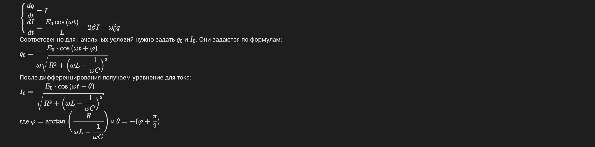
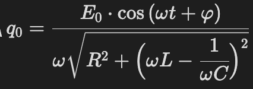
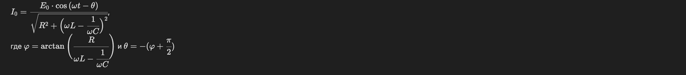
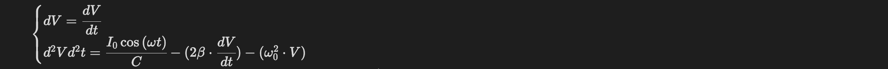
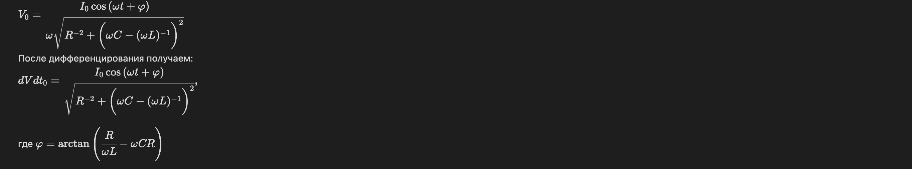

# Колебания в электрической цепи

## Зависимости
Python3, numpy, matplotlib

## Описание последовательной цепи
Для численного моделирования использовался метод Рунге-Кутты 4-го порядка

Для последовательной RLC цепи было взято и преобразованно диффиринциальное уравнение 2 порядка:
$\\ \cfrac{d^2q}{dt^2} + 2\beta\cfrac{dq}{dt} + \omega_{0}^{2}q = \cfrac{E_{0}}{L}\cos{(\omega t)}$,  
где q - заряд, t - время, $E_{0}$ - амплитуда напряжения, L - индуктивность, R - сопротивление, С - емксоть конденсатора, $2\beta = \cfrac{R}{L}$, $\omega_{0}^{2} = \cfrac{1}{LC}$

Для численного дифференцирования преобразуем уравнение в систему уравнений первого порядка:

 

Соответсвенно для начальных условий нужно задать $q_{0}$ и $I_{0}$. Они задаются по формулам:

 

После дифференцирования получаем уравнение для тока:

 

## Описание параллельной цепи
Для параллельной RLC цепи было взято и преобразованно диффиринциальное уравнение 2 порядка:
$\\ \cfrac{d^2V}{dt^2} + \cfrac{1}{R} \cdot \cfrac{dV}{dt} + \cfrac{V}{L} = I_{0}\sin{(\omega t)}$,  
где V - напряжение, t - время, L - индуктивность, R - сопротивление, С - емксоть конденсатора.

Для численного дифференцирования преобразуем уравнение в систему уравнений первого порядка:

 

Соответсвенно для начальных условий нужно задать $V_{0}$ и $V/dt_{0}$. Они задаются по формулам:

 

К конечным результатам был применен шум, реализованный как случайное число в нормальном распределении c параметрами 0 и 0.5.

## Примеры результата

### 1:

 


### 2:

 


### 3:

 


### 4:

 


# Обратная задача для вычисления исходных параметров

## Описание

Данная программа решает задачу обратного вычисления исходных параметров системы с помощью метода Гаусса-Ньютона. Задача заключается в восстановлении значений сопротивления \( R \), индуктивности \( L \) и емкости \( C \) системы на основе наблюдаемых данных для тока и напряжения, которые были сгенерированы с небольшими возмущениями. Метод Гаусса-Ньютона используется для минимизации невязки между наблюдаемыми и модельными значениями тока и напряжения.

## Алгоритм

1. **Моделирование системы**:
   - Система состоит из параметров \( R \), \( L \) и \( C \), которые описывают электрическую цепь. Математически система описана следующими уравнениями:
   
     $\frac{di}{dt} = \frac{1}{L} \left( U - Ri - \frac{q}{C} \right)$
     где:
     - \( i \) — ток,
     - \( U \) — напряжение,
     - \( q \) — заряд,
     - \( R \) — сопротивление,
     - \( L \) — индуктивность,
     - \( C \) — емкость.

2. **Наблюдаемые данные**:
   - Генерируются с использованием истинных значений параметров, после чего на них накладывается случайный шум, чтобы имитировать реальные данные. Математически это можно записать как:
   
     
     $z_i = x_i + \epsilon_i$
    
     где:
     - \( z_i \) — наблюдаемое значение,
     - \( x_i \) — истинное значение,
     - \( \epsilon_i \) — случайный шум, распределенный по нормальному закону.

3. **Решение обратной задачи**:
   - Для восстановления параметров системы применяется метод Гаусса-Ньютона. Программа использует функцию невязки \( \text{f}(R, L, C) \), которая вычисляет разницу между модельными и наблюдаемыми значениями для тока и напряжения. Метод минимизирует эту разницу для нахождения оптимальных значений параметров \( R \), \( L \), и \( C \):
   
     
     $\text{f}(R, L, C) = \sum_{i} \left( z_i - \hat{x}_i(R, L, C) \right)^2$
     где $\hat{x}_i(R, L, C)$ — модельное значение для текущих параметров.


## Запуск программы

1. **Необходимые зависимости**:
   - `numpy`
   - `scipy`
   - `matplotlib`

2. **Ввод и вывод**:
   - Программа генерирует "наблюдаемые" данные для тока и напряжения с добавлением шума.
   - Программа использует оптимизационный метод для восстановления параметров системы.
   - Выводится восстановленные значения параметров \( R \), \( L \) и \( C \).

## Пример работы


Пример вывода программы:
[Смотреть видео на YouTube](https://www.youtube.com/watch?v=uPWY3GTxyaA)
```bash
Восстановленные параметры: R = 10.2117, L = 99.7524, C = 0.01495
